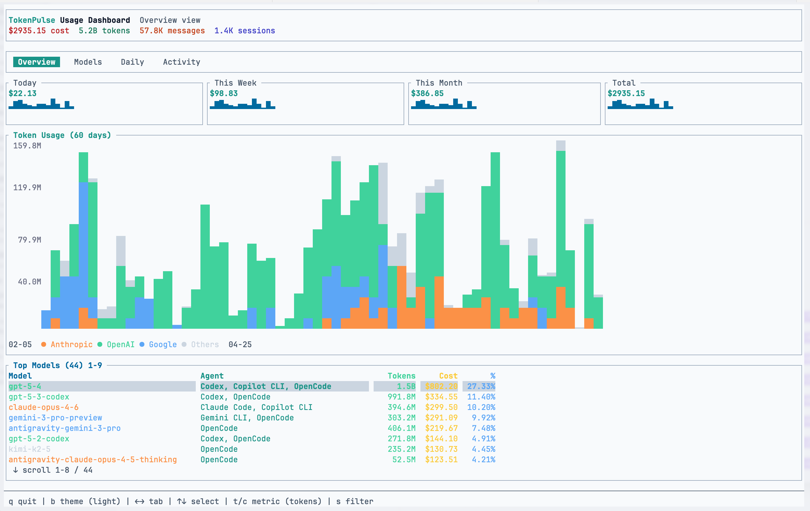
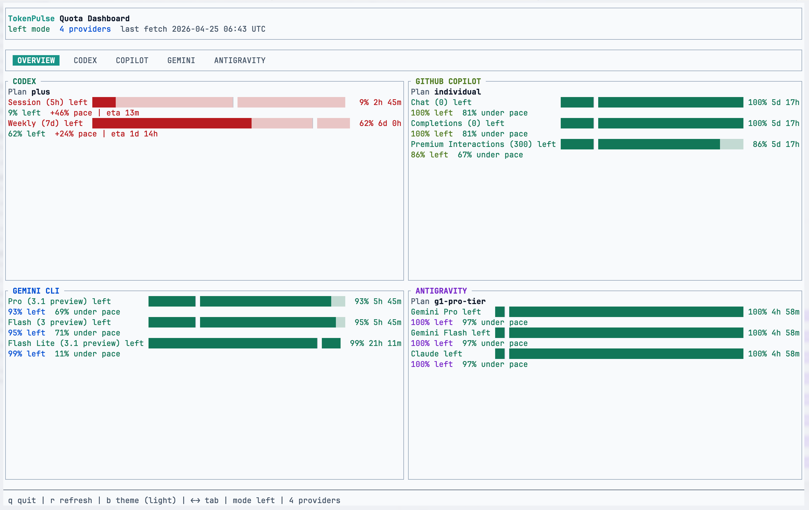
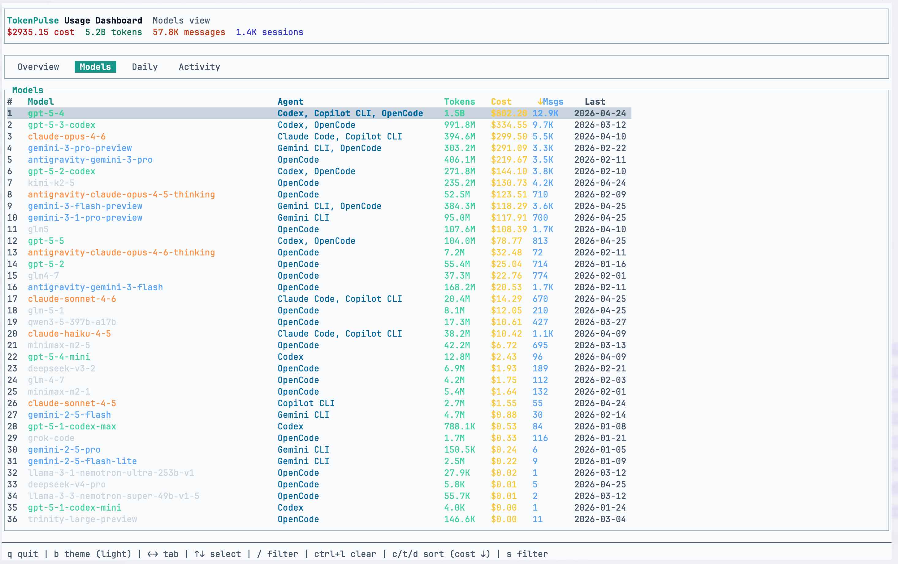
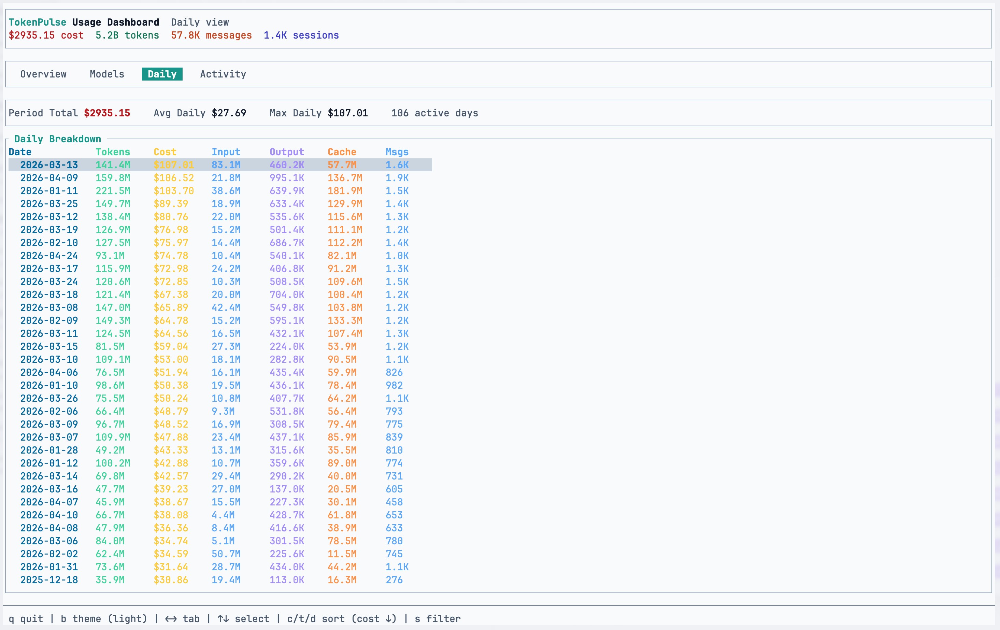
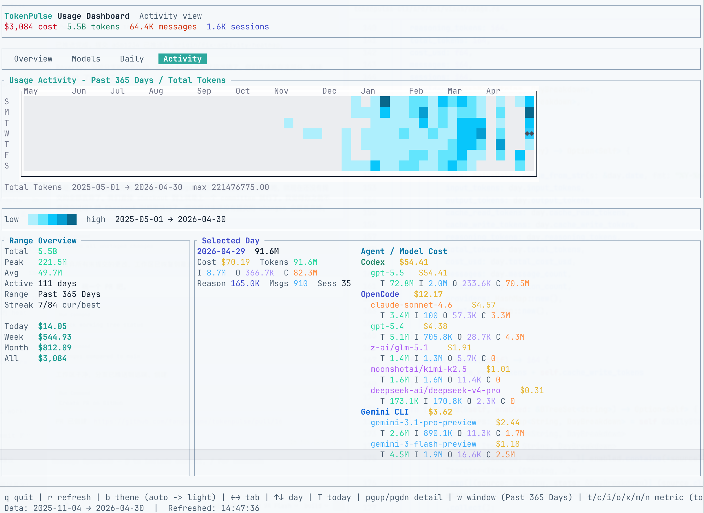

# TokenPulse

TokenPulse is a Rust CLI for inspecting coding-agent quota and historical token usage from local machine data.

It has two core commands:

- `quota`: fetch remaining quota from supported providers on demand
- `usage`: parse local histories into a SQLite ledger and show a TUI or plain-text summary

## Current Coverage

Usage parsing currently supports:

- Claude Code
- Codex
- OpenCode
- Gemini CLI
- PI
- GitHub Copilot CLI

Quota fetching currently supports:

- Claude Code
- Codex
- Gemini CLI
- GitHub Copilot
- Antigravity

Notes:

- usage coverage is strongest today for Claude Code, Codex, OpenCode, and Copilot
- Gemini usage is still provisional
- Antigravity historical usage is not complete yet

## Screenshots

| Overview | Quota |
|---|---|
|  |  |

| Models | Daily |
|---|---|
|  |  |

| Activity |
|---|
|  |

## Features

- ledger-backed usage history stored in local SQLite
- per-day pricing snapshots so historical cost does not silently drift
- quota overview (top 3 windows) plus per-provider detail tabs with pace ETA and expected-progress marker
- **auto-refresh in quota TUI** — configurable intervals (1/2/5/10/15 min, default 5 min); cycle with `a`, shows countdown in footer
- **`r` to refresh** in both quota and usage TUI without restarting (shown in footer for all tabs)
- usage dashboard with `Overview`, `Models`, `Daily`, and `Activity` tabs
- 60-day stacked bar chart switchable between token and cost views
- block-character heatmap intensity (`░▒▓█`) for value levels — accessible without color
- **GitHub-style quartile heatmap coloring** — equal-count quartiles so activity levels are spread naturally
- mouse-selectable activity heatmap with agent/model drill-down and scrollable selected-day detail
- **models table `%` column** — share of the active sort metric for the filtered set (cost when sorted by cost/date, token share when sorted by tokens)
- **overview space reclaimed** — removed summary cards; freed rows show more models; Today/Week/Month cost shown in Daily and Activity tabs
- usage `--json` output for scripts
- company-aware model coloring and agent/provider separation
- quick filter (`/`) in models table; source filter overlay (`s`)
- plain-text mode for scripting and remote shells

## Install

Requirements:

- Rust toolchain
- local agent/session data on the same machine

Build the workspace:

```bash
cargo build --workspace
```

Run the CLI:

```bash
cargo run -p tokenpulse-cli -- --help
```

## Quick Start

Initialize config:

```bash
tokenpulse init
```

Check quota:

```bash
tokenpulse quota
tokenpulse quota -p claude
tokenpulse quota --no-tui
```

Configure quota auto-refresh interval (0=disabled, 1/2/5/10/15 minutes):

```bash
tokenpulse config set quota_auto_refresh_interval=5
tokenpulse config set quota_auto_refresh_interval=0   # disable
```

Or press `a` in the quota TUI to cycle through intervals live.

Inspect usage:

```bash
tokenpulse usage
tokenpulse usage --tui
tokenpulse usage --no-tui
tokenpulse usage --json
tokenpulse usage --since 2026-04-01
tokenpulse usage -p claude,codex,copilot
tokenpulse usage --refresh-days 2026-04-01:2026-04-09
tokenpulse usage --refresh-pricing
tokenpulse usage --rebuild-all
```

## Data Model

TokenPulse tracks two different concepts:

- `Agent`: the client tool you used, such as `Claude Code`, `Codex`, `OpenCode`, `Gemini CLI`, or `Copilot CLI`
- `Provider`: the backend/model company, such as `Anthropic`, `OpenAI`, `Google`, or `Copilot`

The usage dashboard keeps those separate so the same model family can be attributed across multiple agents.

## Local Storage

TokenPulse stores local state under standard cache/config locations:

- config: `~/.config/tokenpulse/config.toml`
- usage ledger: platform cache dir, typically `~/Library/Caches/tokenpulse/usage.sqlite3` on macOS
- pricing cache: `~/.cache/tokenpulse/pricing.json`

## Project Structure

```text
tokenpulse-core/   core parsing, pricing, quota, and ledger logic
tokenpulse-cli/    CLI entrypoints and TUI
docs/              design and module documentation
```

## Development

Run formatting and tests:

```bash
cargo fmt --all
cargo test --workspace
```

Primary design notes live in [docs/DESIGN.md](docs/DESIGN.md).

## Acknowledgments

TokenPulse was inspired by and builds on ideas from these projects:

- **[CodexBar](https://github.com/steipete/CodexBar)** by [@steipete](https://github.com/steipete) — macOS menu bar app for real-time quota visibility across many coding agent providers. The auth flows and quota API patterns for Codex, Copilot, Gemini, and Antigravity were informed by its open-source implementation.

- **[tokscale](https://github.com/junhoyeo/tokscale)** by [@junhoyeo](https://github.com/junhoyeo) — Rust CLI + TUI for tracking token usage and costs across multiple AI coding agents. Inspired the multi-tab dashboard layout (Overview / Models / Daily / Activity) and multi-agent attribution design.

- **[openusage](https://github.com/robinebers/openusage)** by [@robinebers](https://github.com/robinebers) — macOS menu bar for AI subscription usage tracking. Inspired the breadth of provider coverage and the plugin-based approach to adding new quota sources.
