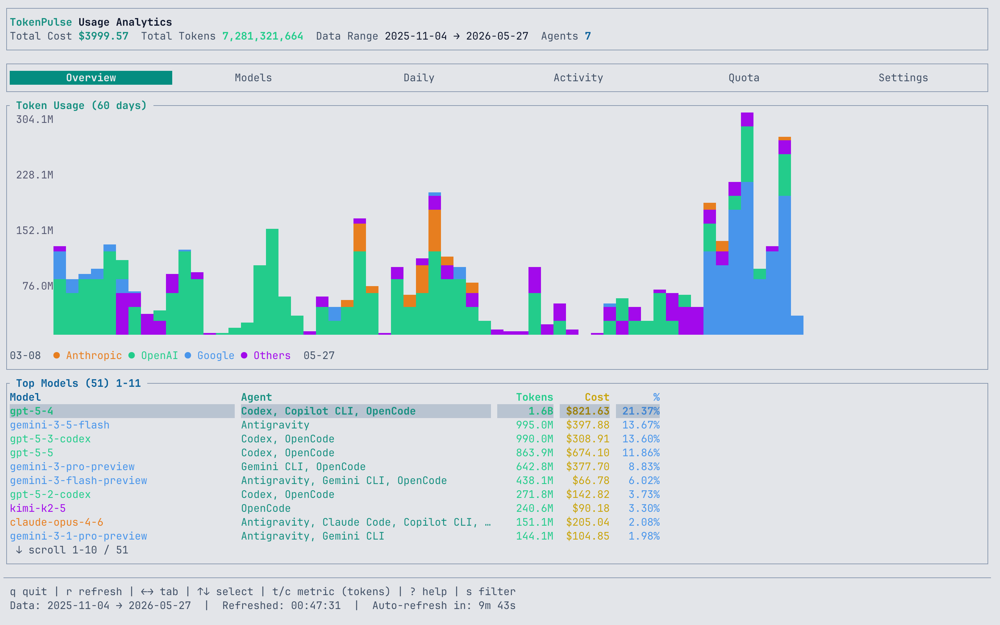
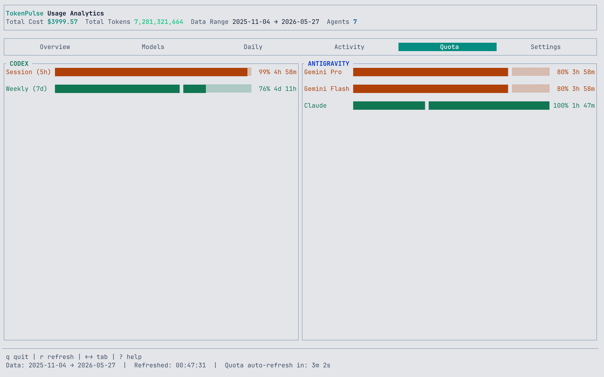
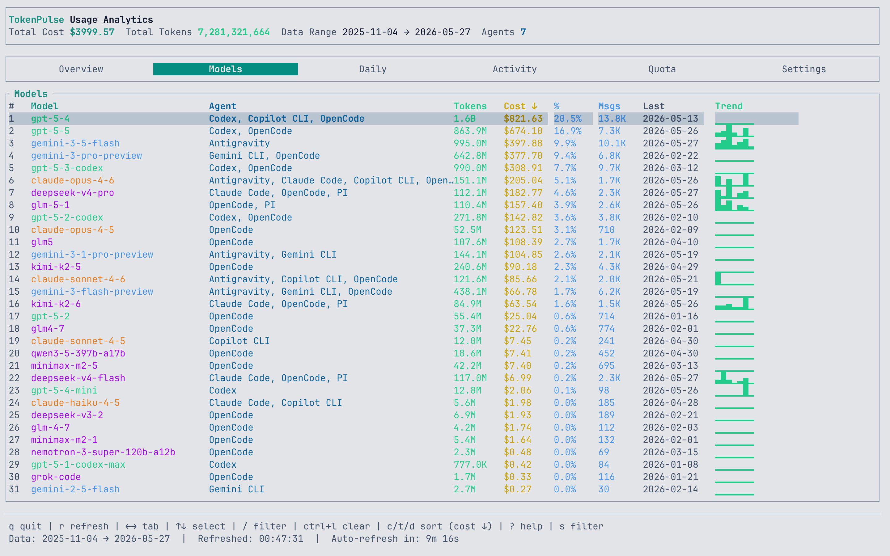
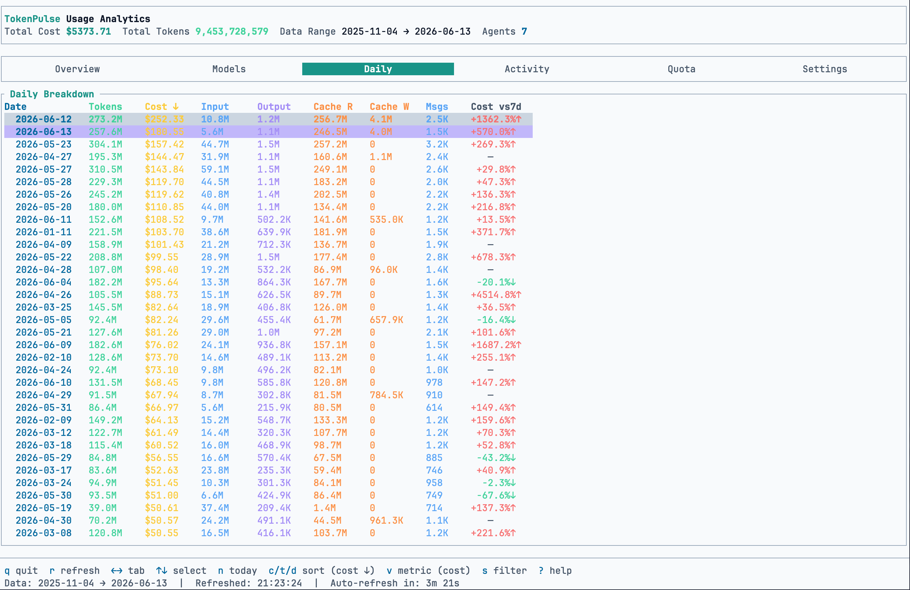
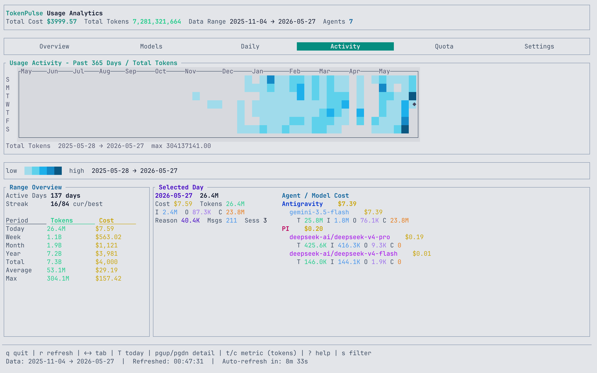
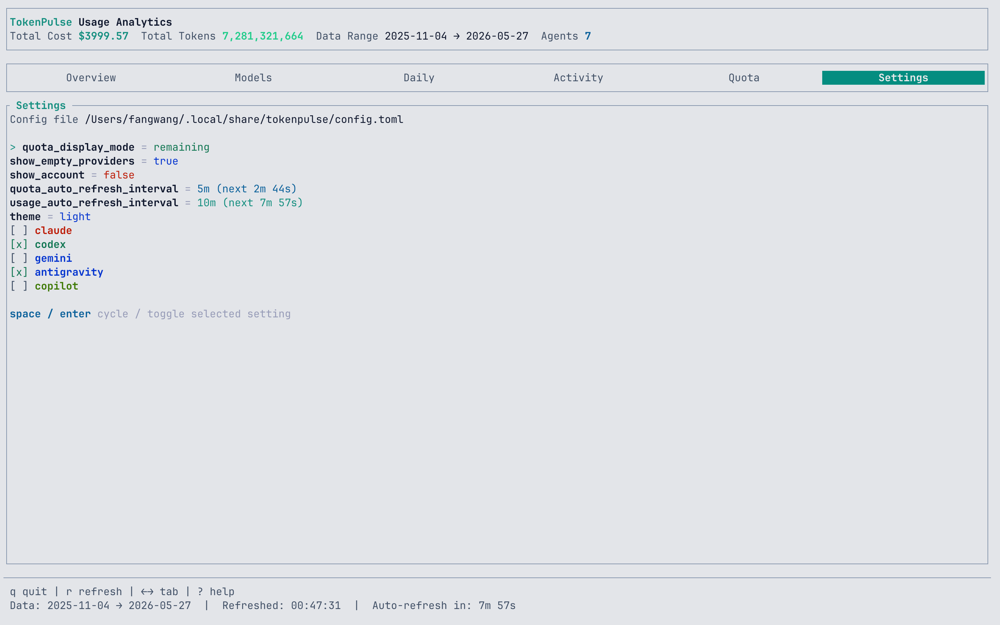

# TokenPulse

TokenPulse is a Rust CLI for inspecting coding-agent quota and historical token usage from local machine data.

It has two core commands:

- `quota`: fetch remaining quota from supported providers on demand
- `usage`: parse local histories into a SQLite ledger and show a TUI or plain-text summary

## Current Coverage

Usage parsing currently supports:

- Claude Code
- Codex
- OpenCode
- Gemini CLI
- PI
- GitHub Copilot CLI
- Antigravity

Quota fetching currently supports:

- Claude Code
- Codex
- GitHub Copilot
- Antigravity

Notes:

- usage coverage is strongest today for Claude Code, Codex, OpenCode, Copilot, and Antigravity
- Gemini usage is retained for historical analytics and handles streamed JSONL deduplication plus cache-inclusive input tokens
- Antigravity usage scans local conversation files and syncs with running Language Servers (GUI/CLI)


## Screenshots

| Overview | Quota |
|---|---|
|  |  |

| Models | Daily |
|---|---|
|  |  |

| Activity | Settings |
|---|---|
|  |  |

## Features

- ledger-backed usage history stored in local SQLite
- per-day pricing snapshots so historical cost does not silently drift
- quota overview (top 3 windows) plus per-provider detail tabs with pace ETA and expected-progress marker
- **auto-refresh in TUI** — configurable intervals for quota TUI (1/2/5/10/15 min, default 5 min) and usage TUI (5/10/15/30 min, default 10 min); cycle/toggle in Settings tab, shows countdown in footer
- **`r` to refresh** in both quota and usage TUI without restarting (shown in footer for all tabs)
- usage dashboard with `Overview`, `Models`, `Daily`, and `Activity` tabs
- 60-day stacked bar chart switchable between token and cost views
- solid-cell heatmap coloring for value levels
- **Theme-invariant heatmap** — cost uses a GitHub-green palette, tokens use a Kaggle-blue palette, with soft gray backgrounds/borders that stay consistent in both dark and light modes, and five intensity levels scale at 20/40/60/80% of the visible window peak
- mouse-selectable activity heatmap with clickable legend ranges, agent/model drill-down, and scrollable selected-day detail
- **models table `%` column** — share of the active sort metric for the filtered set (cost when sorted by cost/date, token share when sorted by tokens)
- **overview space reclaimed** — removed summary cards; freed rows show more models; Today/Week/Month cost shown in Daily and Activity tabs
- usage `--json` output for scripts
- company-aware model coloring and agent/provider separation
- quick filter (`/`) in models table; source filter overlay (`s`)
- plain-text mode for scripting and remote shells

## Install

Requirements:

- Rust toolchain
- local agent/session data on the same machine

Build the workspace (in release mode for optimal performance):

```bash
cargo build --release --workspace
```

Run the CLI (use `--release` for optimal TUI rendering and quick database aggregations):

```bash
cargo run --release -p tokenpulse-cli -- --help
```

## Quick Start

Initialize config:

```bash
tokenpulse init
```

Check quota:

```bash
tokenpulse quota
tokenpulse quota -p claude
tokenpulse quota --no-tui
```

Configure auto-refresh intervals (0=disabled):

```bash
# Quota TUI (default 5 min, supported: 0, 1, 2, 5, 10, 15)
tokenpulse config set quota_auto_refresh_interval=5
# Usage TUI (default 10 min, supported: 0, 5, 10, 15, 30)
tokenpulse config set usage_auto_refresh_interval=10
```

Or toggle these intervals directly inside the Settings tab of the TUI.

Inspect usage:

```bash
tokenpulse usage
tokenpulse usage --tui
tokenpulse usage --no-tui
tokenpulse usage --json
tokenpulse usage --since 2026-04-01
tokenpulse usage -p claude,codex,copilot
tokenpulse usage --refresh-days 2026-04-01:2026-04-09
tokenpulse usage --refresh-pricing
tokenpulse usage --rebuild-all
tokenpulse usage --log
```

If you previously ingested Gemini usage before the parser fix, the next `tokenpulse usage` run will automatically rebuild stored Gemini rows when it sees an older parser version. You can also force a one-shot refresh with `tokenpulse usage -p gemini --rebuild-all`.

Antigravity keeps a TokenPulse-managed raw cache under `~/.local/share/tokenpulse/antigravity-cache/`. Normal usage runs refresh Antigravity sessions whose local CLI/Desktop conversation files changed in the last two days. CLI and Desktop copies are stored separately but roll up under one `antigravity` source and are deduplicated by `session_id + message_id`. Use `tokenpulse usage --rebuild-all` to rebuild all discoverable Antigravity raw cache files from a running Antigravity language server.

For file-backed agents such as Claude Code, Codex, Copilot, Gemini CLI, and PI, normal usage runs parse changed session files in parallel and replace the ledger rows for those changed sessions. OpenCode keeps its direct SQLite timestamp scan because it can read only recent database rows without reparsing whole session files.

Pass `--log` to write usage startup timing to a new file under `~/.local/share/tokenpulse/log/`, named with the run timestamp. Normal usage runs reuse an existing stale pricing cache to avoid blocking the dashboard on remote pricing timeouts; pass `--refresh-pricing` when you explicitly want a live pricing refresh.

## Data Model

TokenPulse tracks two different concepts:

- `Agent`: the client tool you used, such as `Claude Code`, `Codex`, `OpenCode`, `Gemini CLI`, or `Copilot CLI`
- `Provider`: the backend/model company, such as `Anthropic`, `OpenAI`, `Google`, or `Copilot`

The usage dashboard keeps those separate so the same model family can be attributed across multiple agents.

## Local Storage

TokenPulse stores local state under a single unified directory:

- config: `~/.local/share/tokenpulse/config.toml`
- usage ledger: `~/.local/share/tokenpulse/usage.db`
- pricing cache: `~/.local/share/tokenpulse/pricing.json`

## Project Structure

```text
tokenpulse-core/   core parsing, pricing, quota, and ledger logic
tokenpulse-cli/    CLI entrypoints and TUI
docs/              design and module documentation
```

## Development

Run formatting and tests:

```bash
cargo fmt --all
cargo test --workspace
```

> [!TIP]
> **Performance Profiling**:
> When testing startup latency, file parsing speed, or TUI performance, always build and run with the `--release` flag (e.g. `cargo run --release -- usage`). Rust's unoptimized debug build (`dev` profile) runs mtime stat checks, JSON parsing, and SQLite queries up to 5x slower, which can distort performance measurements.

Primary design notes live in [docs/DESIGN.md](docs/DESIGN.md).

## Acknowledgments

TokenPulse was inspired by and builds on ideas from these projects:

- **[CodexBar](https://github.com/steipete/CodexBar)** by [@steipete](https://github.com/steipete) — macOS menu bar app for real-time quota visibility across many coding agent providers. The auth flows and quota API patterns for Codex, Copilot, Gemini, and Antigravity were informed by its open-source implementation.

- **[tokscale](https://github.com/junhoyeo/tokscale)** by [@junhoyeo](https://github.com/junhoyeo) — Rust CLI + TUI for tracking token usage and costs across multiple AI coding agents. Inspired the multi-tab dashboard layout (Overview / Models / Daily / Activity) and multi-agent attribution design.

- **[openusage](https://github.com/robinebers/openusage)** by [@robinebers](https://github.com/robinebers) — macOS menu bar for AI subscription usage tracking. Inspired the breadth of provider coverage and the plugin-based approach to adding new quota sources.
